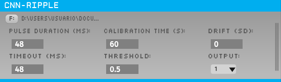

# CNN-ripple plugin for Open Ephys

**CNN-ripple** is a 1D convolutional neural network (CNN) operating over high-density LFP recordings to detect hippocampal SWR both offline and online. It works with recordings from several types of recordings (e.g. linear arrays, high-density probes, ultradense Neuropixels).

This plugin allows the use of CNN-ripple as a real-time detection tool as part of the Open Ephys platform.

You can check our results in our manuscript (Navas-Olive, Amaducci et al.).

## Installing the plugin

Download the latest release for your operating system from https://github.com/PridaLab/CNNRippleDetectorOEPlugin/releases.

For Linux:
1. Copy the `CNNRippleDetectorOEPlugin.so` file to Open Ephys `plugins` folder.
2. Download Tensorflow 2.3.0 libraries into `CNNRippleDetectorOEPlugin/libs/bin/x64`. You need to extract the content of the `lib` folder from this [TAR file](https://storage.googleapis.com/tensorflow/libtensorflow/libtensorflow-cpu-linux-x86_64-2.3.0.tar.gz).

For Windows (default path for plugins: `C:\ProgramData\Open Ephys`):
1. Copy the `CNNRippleDetectorOEPlugin.dll` file to Open Ephys `plugins` folder.
2. Download Tensorflow 2.3.0 libraries into Open Ephys `shared` folder. You need to extract the `.dll` file from the `lib` folder from this [ZIP file](https://storage.googleapis.com/tensorflow/libtensorflow/libtensorflow-cpu-windows-x86_64-2.3.0.zip).


## Running Open Ephys with the plugin

For Linux:
1. Open a terminal and load Tensorflow dynamic libraries using
```
export LD_LIBRARY_PATH=$LD_LIBRARY_PATH:<your_path>/CNNRippleDetectorOEPlugin/libs/bin/x64/
```
2. Run Open Ephys on the same terminal.


For Windows:
1. Run Open Ephys.


## Plugin configuration
The plugin receives 8 channels as input. You can use the `ChannelMap` plugin to select the channels.


- **File:** selector for the CNN model `.pb` file. Can be found in the `CNNRippleDetectorOEPlugin/model` directory.
- **Pulse duration:** duration of the TTL pulse sent when a ripple is detected (in milliseconds).
- **Timeout:** recovery time after a pulse is sent (in milliseconds).
- **Calibration:** calibration time before the experiment to setup the signals normalization (in seconds). One minute is usually enough.
- **Threshold:** probability threshold for the detections. Between 0 and 1.
- **Drift:** number of standard deviations above which the signal is considered to be dominated by extreme offset drift and the CNN will not predict.
- **Output:** output channel for TTL pulses.


## Compiling the plugin from source

1. Clone this repository in the same directory where [`plugin-GUI`](https://github.com/open-ephys/plugin-GUI) is located.
2. Download Tensorflow 2.3.0 libraries into `CNNRippleDetectorOEPlugin/libs/bin/x64`. You need to extract the content of the `lib` folder from this [TAR file (for Linux)](https://storage.googleapis.com/tensorflow/libtensorflow/libtensorflow-cpu-linux-x86_64-2.3.0.tar.gz) or this [ZIP file (for Windows)](https://storage.googleapis.com/tensorflow/libtensorflow/libtensorflow-cpu-windows-x86_64-2.3.0.zip).
3. Go to the `Build` directory and execute to create the CMake project:

For Linux:
```
cmake -G "Unix Makefiles" -DCMAKE_BUILD_TYPE=Release  ..
```

For Windows:
```
cmake -G "Visual Studio 16 2019" -A x64 -DCMAKE_CXX_FLAGS="/EHsc /utf-8" ..
```

4. To compile and install the plugin:

On Linux, in the same `Build` directory:
```
make
make install
```

On Windows, open Visual Studio 16 2019 and compile and install the solution (see notes below on how to install Visual Studio).

5. Install and run the plugin as indicated above.


## How to install Visual Studio 2019 and Open Ephys from source
1. Clone [Open Ephys GUI repository](https://github.com/open-ephys/plugin-GUI).

2. Download and install Visual Studio 2019.

3. Run `Resources/DLLs/FrontPanelUSB-DriverOnly-4.4.0.exe` to install DAQ drivers if needed.

4. Install C++ compiling tools for Visual Studio 2019 and create a new project so everything gets [properly configured](https://stackoverflow.com/questions/31619296/cmake-does-not-find-visual-c-compiler).

5. Download and install CMake. Select "Add CMake to the system PATH".

6. Add the line `add_definitions(-DWIN32)` into line 107 of CMakeLists.txt.

7. Open PowerShell, go to folder plugin-GUI/Build and run CMake. 

```
cmake -G "Visual Studio 16 2019" -A x64 -DCMAKE_CXX_FLAGS="/EHsc /utf-8" ..
```

`-A` indicates the target architecture, which must be specified accordingly.

8. Open `open-ephys-GUI.sln`, which can be found in the `Build` directory, with Visual Studio 2019.

9. Compile the solution.
